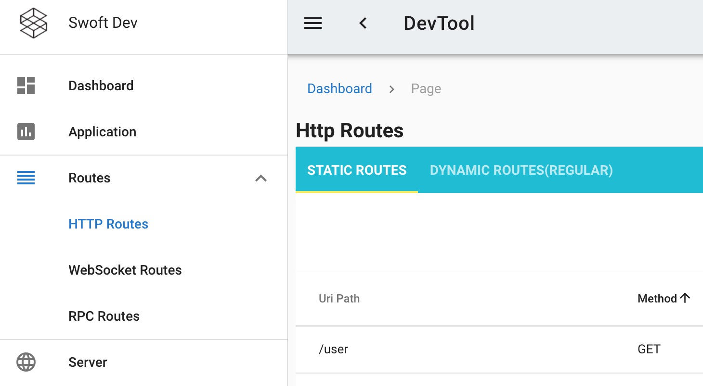

# swoft-devtool

Dev tool for swoft

## Install

- composer command

```bash
composer require swoft/devtool
```

## Document

Please see [document site](https://doc.swoft.org)

## Quick start

1. add http middleware in `config/beans/base.php`

```php
'serverDispatcher' => [
      'middlewares' => [
          // ...
          \Swoft\Devtool\Middleware\DevToolMiddleware::class,
      ]
  ],
```

2. some optional config for devtool(in `config/properties/app.php`).

```php
'devtool' => [
    'logEventToConsole' => true,
    'logHttpRequestToConsole' => true,
],
```

3. publish devtool's assets to public dir.

```bash
php bin/swoft dev:publish swoft/devtool
```

4. now, you can access your server address by browser. like `http://127.0.0.1:9088/__devtool/`

5. If you see the following screen, you have successfully installed



## Unit testing

```bash
phpunit test/unit
```

## LICENSE

The Component is open-sourced software licensed under the [Apache license](LICENSE).

